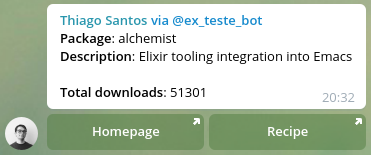

# Melpa Telegram Bot

This is a Telegram bot that fetches information from [Melpa Emacs Package Repository](melpa.org) and displays on a nice card-style format.

Made with Elixir and the [Nadia](https://github.com/zhyu/nadia) telegram bot API wrapper.

It works by fetching `melpa.org/archive.json` and `melpa.org/download_counts.json`, parsing them and then storing the package information on a database every 1 hour.

# Table of Contents

-   [Installation](#installation)
-   [Usage](#usage)
-   [Contributing](#contributing)
-   [TODO List](#todo)
-   [License](#license)

## Installation

To install the bot locally:

- Clone this repository
- Navigate to its folder: `cd melpa_telegram_bot`
- Run `mix deps.get`
- Run `docker-compose up` to mount the database instance
- Run `mix run --no-halt` to run the bot

## Usage

To use the bot, once its running, invoke it on Telegram from any chat using the inline syntax:
`@bot_name <name-of-melpa-package>`

Example:

`@melpa_bot alchemist`

## Contributing

- Fork it!
- Clone your fork: `git clone https://github.com/<your-username>/red_mutex`
- Navigate to the newly cloned directory: `cd red_mutex`
- Install the dependencies: `mix deps.get`
- Create a new branch for the new feature: `git checkout -b my-new-feature`
- Make your changes.
- Commit your changes: `git commit -am 'feat(name): add some feature'`
- Push to the branch: `git push origin my-new-feature`
- Submit a pull request with full remarks documenting your changes.

## TODO

- [ ] Humanize total downloads response
- [x] Write Readme
- [ ] Add tests
- [ ] Add Credo
- [ ] Add CI
- [ ] Configure GitHooks
- [ ] Configure distillery
- [ ] Deploy on gigalixir

## License

[MIT license](LICENSE) &copy; [Thiago Santos](https://github.com/thiamsantos)
