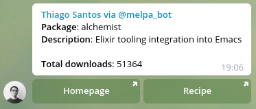
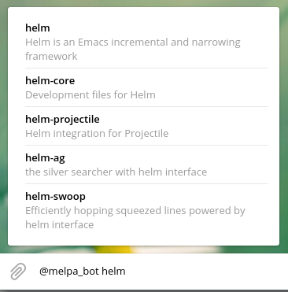

<<<<<<< HEAD
# PackagesBot
=======
# Melpa Telegram Bot
>>>>>>> docs(readme): add description, contributing, usage and license sections

[](https://travis-ci.com/thiamsantos/melpa_telegram_bot)
[](https://coveralls.io/github/thiamsantos/melpa_telegram_bot?branch=master)

This is a Telegram bot that fetches information from [Melpa Emacs Package Repository](melpa.org) and displays it on a nice card-style format.



Made with Elixir and the [Nadia](https://github.com/zhyu/nadia) telegram bot API wrapper.

It works by fetching `melpa.org/archive.json` and `melpa.org/download_counts.json`, parsing them and then storing the package information on a database every 1 hour. The database is then used to get the information about the package requested.

# Table of Contents

-   [Install](#install)
-   [Githooks](#githooks)
-   [Usage](#usage)
-   [Contributing](#contributing)
-   [License](#license)


## Installation

To install the bot locally:

- Clone the repo: `git clone https://github.com/thiamsantos/melpa_telegram_bot`
- Install the [githooks](#githooks)
- Navigate to the newly cloned directory: `cd melpa_telegram_bot`
- Run `mix deps.get`
- Run `docker-compose up` to mount the database instance
- Run `mix run --no-halt` to run the bot

## Usage

To use the bot, once its running, invoke it from any chat on Telegram using the inline syntax:
`@bot_name <name-of-melpa-package>`

Example:



## Githooks

We use githooks to ensure file consistency. Make sure to download and install the hooks after cloning the repo.

```sh
$ curl -o /usr/local/bin/git-hooks https://raw.githubusercontent.com/icefox/git-hooks/master/git-hooks
$ chmod +x /usr/local/bin/git-hooks
$ git-hooks --install
```

## Contributing

- Fork it!
- Clone your fork: `git clone https://github.com/<your-username>/melpa_telegram_bot`
- Navigate to the newly cloned directory: `cd melpa_telegram_bot`
- Install the dependencies: `mix deps.get`
- Create a new branch for the new feature: `git checkout -b my-new-feature`
- Make your changes.
- Commit your changes: `git commit -am 'feat(name): add some feature'`
- Push to the branch: `git push origin my-new-feature`
- Submit a pull request with full remarks documenting your changes.

## TODO

- [ ] Humanize total downloads response
- [x] Write Readme
- [ ] Add tests
- [x] Add Credo
- [x] Add CI
- [x] Add coveralls
- [x] Add CD
- [x] Configure GitHooks
- [x] Configure distillery
- [x] Deploy on gigalixir

## License

[MIT license](LICENSE) &copy; [Thiago Santos](https://github.com/thiamsantos)


